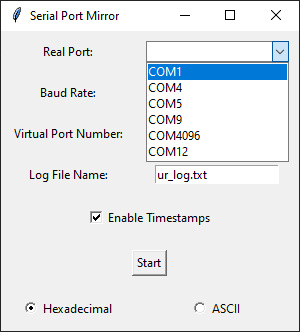

# Eye On Serial Python
## Checked on Windows Only (But easy to create Linux port)
Simple, free and working on widnows com port forwarder with listening capabilities.

Feel free to write the Linux port!



## Note 
If you are running this on windows remember to use don't use COM4 but new one created by com0com (ex. COM4096).

Running on windows requires administrator so right-click on cmd and then call
```
python ./eyeonserial.py
```

Installing dependecies with

```
pip install pyvirtualserial tkinter 
```
Rest should be already preloaded. It should install com0com but if it doesnt please do it manually.

Created using Python 3.11.
